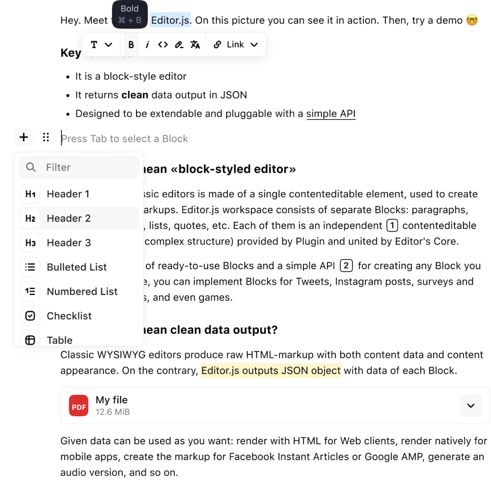
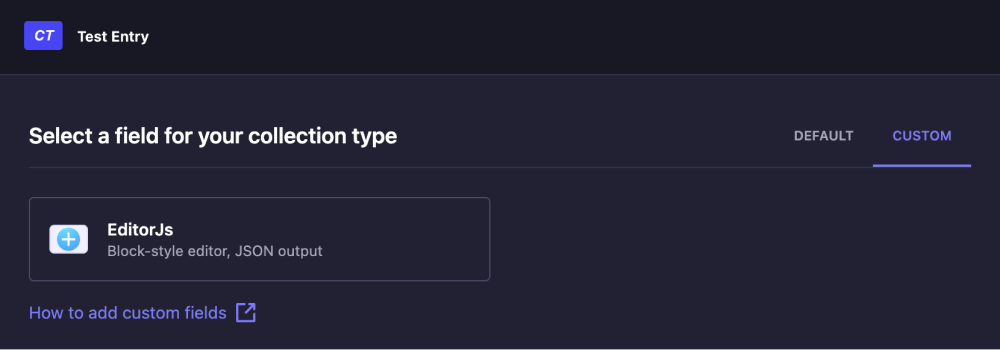
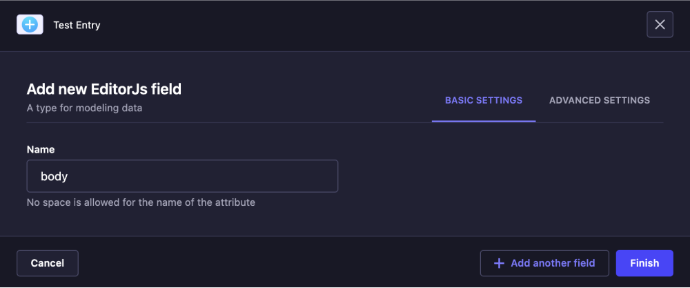
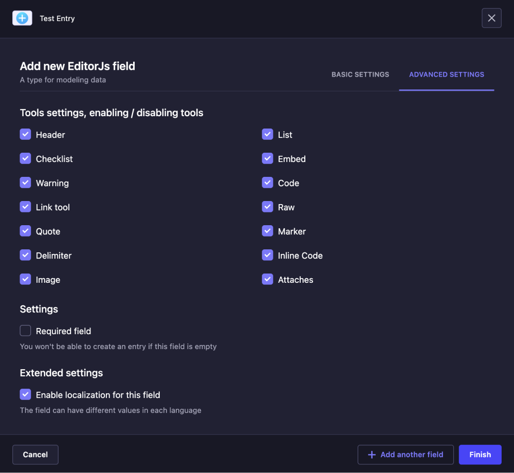

<div align="center">
    
</div>

<div align="center">
  <h1>Strapi v4 - Editor.js + Strapi</h1>
  <p>Editor.js is a block-style editor for rich media stories. It outputs clean data in JSON instead of heavy HTML markup. And more important thing is that Editor.js is designed to be API extendable and pluggable.</p>
</div>



## Features
- Support for localization
- Support light / dark theme
- The option to disable specific tools for each field individually
- Access to configuration Editor.js tools

## Supported all official add-ons

- [x] Paragraph Tool
- [x] [Embed Tool](https://github.com/editor-js/embed)
- [x] [Table tool](https://github.com/editor-js/table)
- [x] [List Tool](https://github.com/editor-js/list)
- [x] [Warning Tool](https://github.com/editor-js/warning)
- [x] [Code Tool](https://github.com/editor-js/code)
- [x] [Link Tool](https://github.com/editor-js/link)
- [x] [Image Tool](https://github.com/editor-js/image)
- [x] [Raw HTML Tool](https://github.com/editor-js/raw)
- [x] [Heading Tool](https://github.com/editor-js/header)
- [x] [Quote Tool](https://github.com/editor-js/quote)
- [x] [Marker Tool](https://github.com/editor-js/marker)
- [x] [Checklist Tool](https://github.com/editor-js/checklist)
- [x] [Delimiter Tool](https://github.com/editor-js/delimiter)
- [x] [InlineCode Tool](https://github.com/editor-js/inline-code)
- [x] [Attaches Tool](https://github.com/editor-js/attaches)

## Instalation

1. Install

```text
#npm
npm install @spalz/strapi-plugin-editorjs-field-help
```

```text
#yarn
yarn add @spalz/strapi-plugin-editorjs-field-help
```

2. Add configuration plugin
```javascript
// config/plugins.ts
export default ({ env }) => ({
  editorjs: {
    enabled: true,
    // resolve: "./src/plugins/strapi-plugin-editorjs-field",
    config: {
      header: {
        inlineToolbar: true,
        config: {
          inlineToolbar: [
            "bold",
            "italic",
            "hyperlink",
            "marker",
            "inlineCode",
          ],
          levels: [2, 3, 4],
          defaultLevel: 2,
        },
      },
      list: { inlineToolbar: true },
      checklist: { inlineToolbar: true },
      embed: null,
      table: { inlineToolbar: true },
      warning: {
        inlineToolbar: true,
      },
      code: null,
      link_tool: {
        config: {
          endpoint: `/api/editorjs/link`, // is required, this need for parser
        },
      },
      raw: null,
      quote: { inlineToolbar: true },
      marker: null,
      delimiter: null,
      inlineCode: { inlineToolbar: true },
      image: null,
      attaches: null,
      minHeight: 200,
    },
  },
});
```

3. To ensure Strapi displays Link Tool thumbnails correctly, you should make a modification in the './config/middlewares.js' file. Please replace the 'strapi::security' line with the following (please proceed with caution):

```javascript
// ./config/middlewares.js

export default [
  ...
  {
    name: "strapi::security",
    config: {
      contentSecurityPolicy: {
        useDefaults: true,
        directives: {
          "img-src": ["'self'", "data:", "blob:"],
          "media-src": ["'self'", "data:", "blob:"],
          upgradeInsecureRequests: null,
        },
      },
    },
  },
  ...
];

```

4. Add custom field in collection type or single type



5. Add field name



6. Configure tools



## Thanks
<p>
This code was developed based on the  <a href="https://github.com/melishev/strapi-plugin-react-editorjs">strapi-plugin-react-editorjs</a> by <a href="https://github.com/melishev">melishev</a>
</p>

## License

[MIT](https://choosealicense.com/licenses/mit/)
# strapi-plugin-editorjs-field
